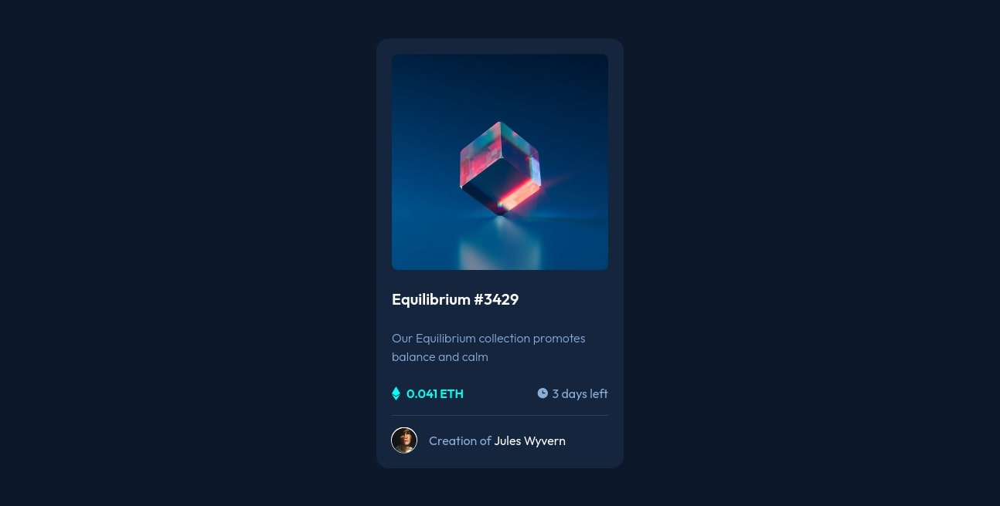

# Frontend Mentor - NFT preview card component solution

This is a solution to the [NFT preview card component challenge on Frontend Mentor](https://www.frontendmentor.io/challenges/nft-preview-card-component-SbdUL_w0U). Frontend Mentor challenges help you improve your coding skills by building realistic projects.

## Table of contents

- [Overview](#overview)
  - [The challenge](#the-challenge)
  - [Screenshot](#screenshot)
  - [Links](#links)
- [Built with](#built-with)
- [Author](#author)

## Overview

### The challenge

Users should be able to:

- View the optimal layout depending on their device's screen size
- See hover states for interactive elements

### Screenshot

### Links

- Solution URL: [https://www.frontendmentor.io/solutions/nft-preview-card-component-using-tailwindcss-and-flexbox-VtQORvJOf](https://www.frontendmentor.io/solutions/nft-preview-card-component-using-tailwindcss-and-flexbox-VtQORvJOf)
- Live Site URL: [https://sissokho.github.io/frontendmentor-nft-preview-card-component/](https://sissokho.github.io/frontendmentor-nft-preview-card-component/)

## Built with

- Semantic HTML5 markup
- Tailwindcss
- Flexbox
- Mobile-first workflow

## Author

- Frontend Mentor - [@sissokho](https://www.frontendmentor.io/profile/sissokho)
- Twitter - [@mm_sissokho](https://twitter.com/mm_sissokho)
- Linkedin - [ Mouhamadou Moustapha SISSOKHO ](https://www.linkedin.com/in/mouhamadou-moustapha-sissokho-548a55125/)
